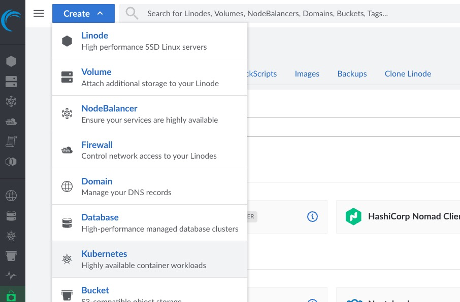
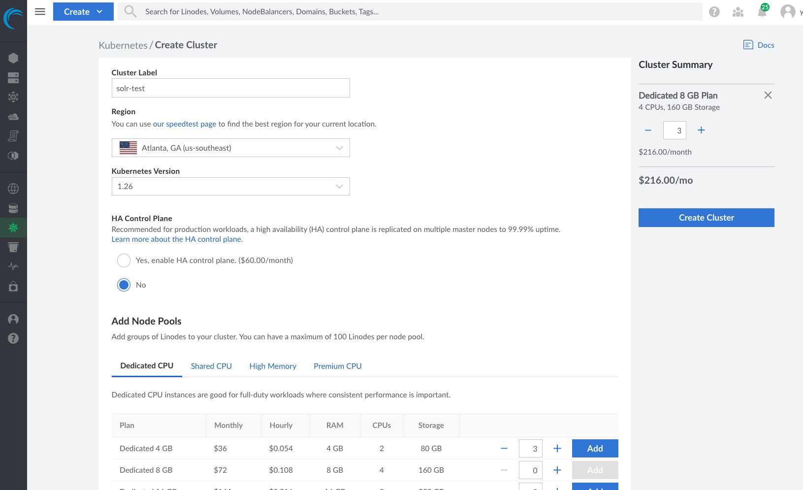
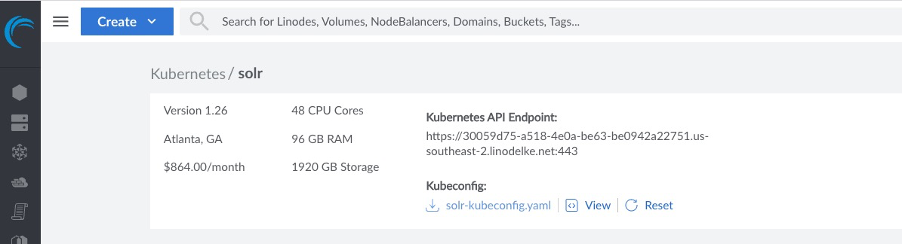
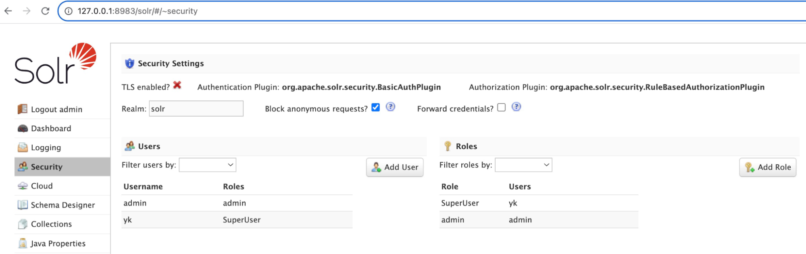
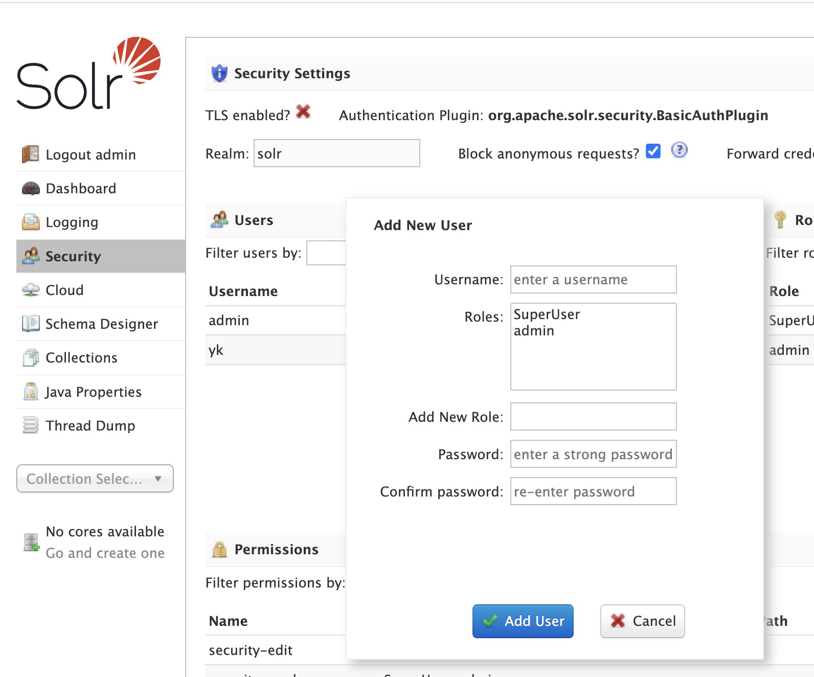
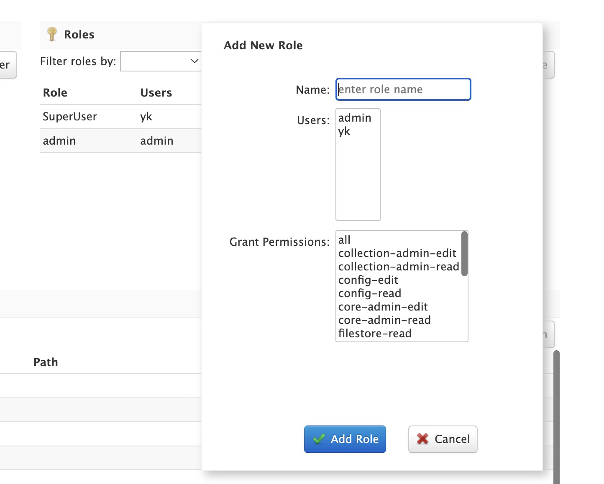

# Introduction

Solr is one of the most popular open-source enterpise-search platform. Running it on Kubernetes has become substantially easy. In this tutorial, you will learn to deploy Solr to Akamai's Linode Kubernetes Engine (LKE) within minutes. LKE is a great option for both individual and enterprise users, as it provides a fully managed vanilla Kubernetes. Pricing is also simple in that you only pay for the infrastructure (e.g. compute nodes, network) without any separate fees for Kubernetes operation. All nodes come with generous network transfer allowance, which helps users keep cost low. 

# Create LKE Cluster
On your browser, navigate to [https://login.linode.com](https://login.linode.com). If you already have an account, you can log into it, otherwise, you may sign up. Once logged into the Linode Cloud Console, click on the "Create" button then on the "Kubernetes" option in the dropdown menu.



Fill out the necessary information such as Cluster Label (basically, the name of the cluster), region to which you wish to deply the cluster, Kubernetes version, etc.




It will take a few minutes to spin up however many nodes you chose to deploy and install Kubernetest on them. Once your cluster has been created, you can then download the `kubeconfig` file to your local machine, by clicking on `[your-cluster-label]-kubeconfig.yaml`, as shown below.

 
 
You can then set the `KUBECONFIG` envrionment variable so that you can use `kubectl` command to interact with your cluster. In your terminal, you can do so by:

```
$ export KUBECONFIG=~/[path-to-your]/solr-kubeconfig.yaml
```

You may verify if you can access the cluster by:

```
$ kubectl get pods -o wide
```
You should see a list of pods running in your cluster


# Deploy Solr to LKE Cluster

Now that you have a Kubernetes cluster running, it's time to deploy Solr to it. You can easily do so by using a Helm chart for Solr, which is available on [VMware's Bitnami repository](https://bitnami.com/stack/solr/helm). 

Run the following command to deploy:

```
$ helm install solr-test oci://registry-1.docker.io/bitnamicharts/solr
```

Once Solr is deployed, you can access the Solr web dashboard. First, you need to get the password for the admin user.

```
$ kubectl get secret --namespace default solr-test -o jsonpath="{.data.solr-password}
```

The above command will print out the password.

We need to set up port forwarding from the local machine to the default Solr dashboard port 8983. By doing so, you can access the dashboard using localhost.

```
$ kubectl port-forward --namespace default svc/solr-test 8983:8983 &
```

Please note the `&` at the end of the command, which would run the forwarder as a background process. If you wish to see output of the forwarder, then run it without the `&` and open up another terminal window to proceed the next step.

# Interact with Solr using Dashboard

You can now open your browser and go to `http://127.0.0.1:8983`. The username is `admin` and the password is the one you captured two steps ago.

Once logged in, you may create a user by first clicking on the `Security` menu option on the left panel.



Click on the `Add User` button and fill out the form.



Then add the user to a role and grant it all available permission for now to make things simple. You may come back and adjust the permissions per your needs.



# Populate Data into Solr
This repo comes with a sample data, which is top articles on September 26th, 2023 from [newsapi.org](https://newsapi.org/)

First, you need to create a collection. In your terminal, run the following command:

```
$ curl --user [your-username]:[your-password] --request POST \
--url http://localhost:8983/api/collections \
--header 'Content-Type: application/json' \
--data '{
  "name": "toparticles",
  "numShards": 1,
  "replicationFactor": 1
}'
```

The command would generate a response like below.

```
{
   "responseHeader":{
      "status":0,
      "QTime":3644
   },
   "success":{
      "solr-test-1.solr-test-headless.default.svc.cluster.local:8983_solr":{
         "responseHeader":{
            "status":0,
            "QTime":962
         },
         "core":"toparticles_shard1_replica_n1"
      }
   },
   "warning":"Using _default configset. Data driven schema functionality is enabled by default, which is NOT RECOMMENDED for production use. To turn it off: curl http://{host:port}/solr/toparticles/config -d '{\"set-user-property\": {\"update.autoCreateFields\":\"false\"}}'"
}

```

You can now define a schema for the collection:

```
$ curl --user [your-username]:[your-password] --request POST \
  --url http://localhost:8983/api/collections/toparticles/schema \
  --header 'Content-Type: application/json' \
  --data '{
  "add-field": [
    {"name": "author", "type": "text_general", "multiValued": true},
    {"name": "title", "type": "text_general", "multiValued": false},
    {"name": "description", "type": "text_general", "multiValued": false},
    {"name": "content", "type": "text_general", "multiValued": false},
    {"name": "url", "type": "string"},
    {"name": "source", "type": "text_general", "multiValued": true}
  ]
}'
```
A response looks similar to below would be printed:

```
{
  "responseHeader":{
    "status":0,
    "QTime":2104
  }
}
```
You can then populate the sample data into the collection:

```
$ curl --user [your-username]:[your-password] -H "Content-Type: application/json" \
       -X POST \
       -d @sample_data.json \
       --url 'http://localhost:8983/api/collections/toparticles/update?commit=true'
```

which would output a response like below:

```
{
  "responseHeader":{
    "rf":1,
    "status":0,
    "QTime":1119
  }
}
```

# Verify Solr Search Works

Search for articles whose title contains `bitcoin`:

```
$ curl -user [your-username]:[your-password] 'http://localhost:8983/solr/toparticles/select?q=title:bitcoin'
```

The command should print out the following:

```
{
  "responseHeader":{
    "zkConnected":true,
    "status":0,
    "QTime":1,
    "params":{
      "q":"title:bitcoin",
      "_forwardedCount":"1"
    }
  },
  "response":{
    "numFound":1,
    "start":0,
    "numFoundExact":true,
    "docs":[{
      "source":["Barron's"],
      "author":["Jack Denton"],
      "title":"Bitcoin Falls With Key Level at Risk. Macro Catalysts Are Looming for Cryptos. - Barron's",
      "description":"In the absence of crypto-native catalysts, traders are likely to focus on the same macroeconomic data releases this week that will move the stock market.",
      "url":"https://www.barrons.com/articles/bitcoin-ethereum-price-crypto-markets-today-47f44d33",
      "urlToImage":["https://images.barrons.com/im-844022/social"],
      "publishedAt":["2023-09-25T10:18:00Z"],
      "id":"c904f4de-8de9-439c-8b63-6a2868a497e5",
      "_version_":1778111805540794368
    }]
  }
}

```

Congratulations! You've got Solr up and running on Kubernetes!